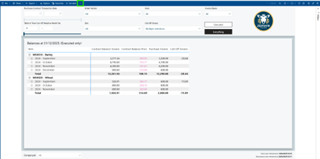
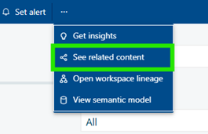
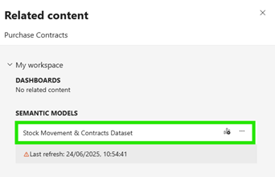

# How to Find What Dataset a Report Relies On

1.  **Open the report** in Power BI

2.  Click the **three dots (****⋯****)** in the top-left corner of the report (as highlighted in a green box below)

3.  Select **'See related content'** from the dropdown menu.

4.  Look under the section labelled **'Semantic models'** (highlighted in green as below). \
    This is the **dataset** that powers the report.

5. If a user wants access to data on this report, they will need to be a member of the user group '**Fabric Dataset Viewer -- Stock Movement & Contracts**'