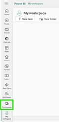

# Managing Workspace Access in Fabric

**What Is a Workspace?**

Think of a **workspace** like a **shared folder** in Fabric that contains **custom Power BI reports**.

-   These reports are **not part** of the standard **Feed Dynamics Reports** app.
-   They are generally used for **custom reporting** needs.
-   Each workspace is tied to a functional area or business unit, like **Sales**, **Haulage**, or **Production**.

**Example Audiences:**

-   **Fabric Workspace Viewer - Production** → Gives access to all reports in the Production workspace
-   **Fabric Workspace Viewer - Receivables** → Gives access to all reports in the Receivables workspace

